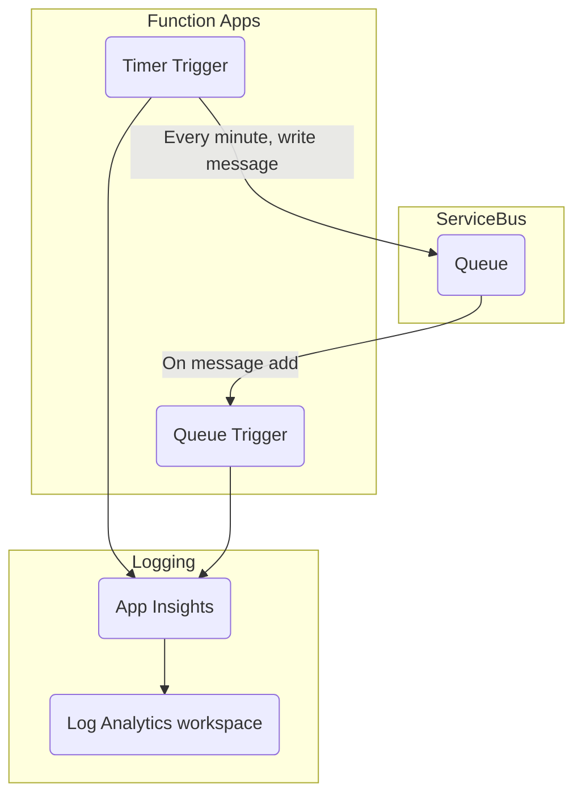

# C# Function Application with Azure Service Bus

[](https://vscode.dev/redirect?url=vscode://ms-vscode-remote.remote-containers/cloneInVolume?url=https://github.com/Gordonby/azd-template-servicebus-dotnet-functionapp)

This template includes everything you need to build, deploy, and monitor an Azure solution that both adds messages to and reacts to messages on an Azure Service Bus queue using Azure Function Apps and the native bindings for Service Bus. It includes application code, that serve as a foundation from which you can build upon and customize when creating your own solution.

Let's jump in and get the apps up and running in Azure. When you are finished, you will have a fully functional Service Bus queue with accompanying Function apps deployed on Azure.

### Prerequisites

The following prerequisites are required to use this application.  Please ensure that you have them all installed locally.

- [Azure Developer CLI](https://aka.ms/azure-dev/install)
  - Windows:
    ```powershell
    powershell -c "Set-ExecutionPolicy Bypass Process -Force; irm 'https://aka.ms/install-azd.ps1' | iex"
    ```
  - Linux/MacOS:
    ```
    curl -fsSL https://aka.ms/install-azd.sh | bash 
    ```
- [Azure CLI (2.37.0+)](https://docs.microsoft.com/cli/azure/install-azure-cli)
- VSCode
- Functions Runtime
- [Git (2.36.1+)](https://git-scm.com/)

### Architecture



### Quickstart

The fastest way for you to get this application up and running on Azure is to use the `azd up` command. This single command will create and configure all necessary Azure resources.

1. Run the following command to initialize the project.

```bash
azd init --template Gordonby/servicebus-dotnet-functionapp
```

This command will clone the code to your current folder and prompt you for the following information:

- `Environment Name`: This will be used as a prefix for all your Azure resources, make sure it is globally unique and under 15 characters.

2. Run the following command to package a deployable copy of your application, provision the template's infrastructure to Azure and also deploy the application code to those newly provisioned resources.

```bash
azd up
```

This command will prompt you for the following information:
- `Azure Location`: The Azure location where your resources will be deployed.
- `Azure Subscription`: The Azure Subscription where your resources will be deployed.

> NOTE: This may take a while to complete as it executes three commands: `azd package` (packages a deployable copy of your application), `azd provision` (provisions Azure resources), and `azd deploy` (deploys application code). You will see a progress indicator as it packages, provisions and deploys your application.
